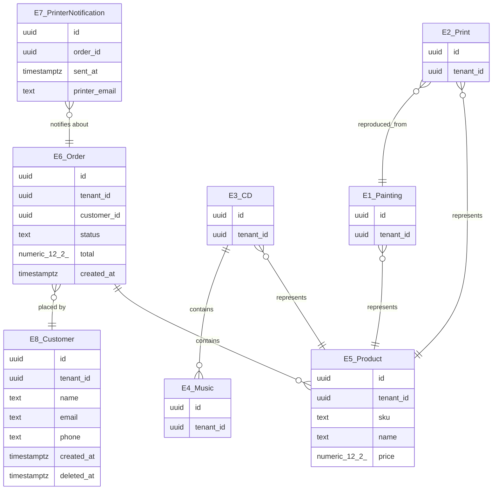

# Entity relationship diagram — Artwork sales website

This diagram contains every captured entity (8) and relationship (8).

## Name legend

| Diagram identifier | Captured entity |
|---|---|
| `E1_Painting` | Painting |
| `E2_Print` | Print |
| `E3_CD` | CD |
| `E4_Music` | Music |
| `E5_Product` | Product |
| `E6_Order` | Order |
| `E7_PrinterNotification` | PrinterNotification |
| `E8_Customer` | Customer |

## Relationship inventory

| # | Source | Kind | Target | Label |
|---:|---|---|---|---|
| 1 | Painting | belongs_to | Product | represents |
| 2 | Print | belongs_to | Product | represents |
| 3 | CD | belongs_to | Product | represents |
| 4 | Print | belongs_to | Painting | reproduced_from |
| 5 | CD | has_many | Music | contains |
| 6 | Order | has_many | Product | contains |
| 7 | PrinterNotification | belongs_to | Order | notifies about |
| 8 | Order | belongs_to | Customer | placed by |
